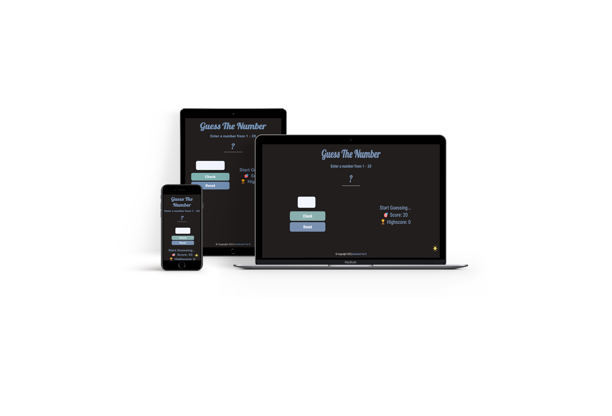
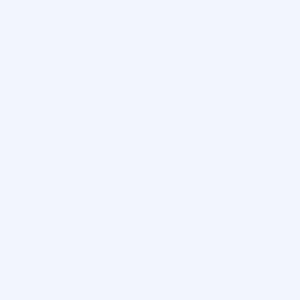

<h1 align="center">  Guess the Number</h1>

<h2>Guess a number between 1 - 20 and check whether your guess is right!
</h2>

## 🖼️ Screenshots
**Light Mode**

**Dark Mode**

## 🎨 Color Pallete

    
    
    
    
     
    
    
    

